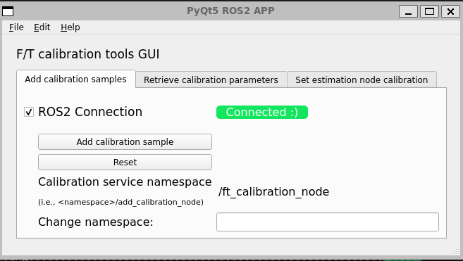
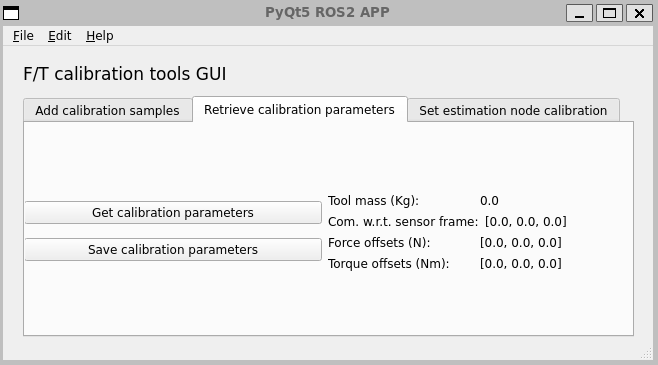

# ft_tools_ros2
Wrench estimation and calibration of F/T sensor for ROS2 applications.


[](https://opensource.org/licenses/Apache-2.0)
[](https://github.com/tpoignonec/ft_tools_ros2/actions/workflows/ci.yml)
[](../../actions/workflows/ci-jazzy.yaml?query=branch:main)
[](../../actions/workflows/ci-rolling.yaml?query=branch:main)

***The current devs are based on the humble ROS 2 distribution (Ubuntu 22.04 LTS)***

**Author:** Thibault Poignonec: [tpoignonec@unistra.fr](mailto:tpoignonec@unistra.fr)

> **Warning**
>
> This package is currently under development!

# Stack content

## F/T sensor calibration utils

### FT parameters object

The common interface to perform sensor calibration and wrench estimation is the [ft_tools::FtParameters](ft_tools/include/ft_tools/ft_parameters.hpp) object that is used by both [ft_tools::FtCalibration](ft_tools/include/ft_tools/ft_calibration.hpp) and [ft_tools::FtEstimation](ft_tools/include/ft_tools/ft_estimation.hpp).
The calibration sensor-specific parameters are:
```yaml
mass: 0.0
sensor_frame_to_com: [0.0, 0.0, 0.0]
force_offset: [0.0, 0.0, 0.0]
torque_offset: [0.0, 0.0, 0.0]
```

The parameters can be loaded:

- from a yaml file:

```cpp
ft_tools::FtParameters ft_parameters
// Load parameters from YAML file (absolute path)
const std::string filename("...")
bool ok = ft_parameters.from_yaml(filename);
// or from a config folder
bool ok = ft_parameters.from_yaml(config_filename, config_package);
```

- from a msg:

```cpp
// Get calibration msg (typically from a service call)
// i.e., ft_msgs::srv::FtCalibration ft_parameters_msg;

ft_tools::FtParameters ft_parameters
bool ok = ft_parameters.from_msg(ft_parameters_msg);
```

The parameters can likewise be written to dump to a yaml file or sent as a msg.

### FT calibration

The [ft_tools::FtCalibration](ft_tools/include/ft_tools/ft_calibration.hpp) implements a simple sensor calibration method [1] using a least square regression (i.e., eigen SVD solver).

We are given N sets of measurements $\left( g, f, \tau \right)$ expressed in the sensor frame of reference where $g \in \mathbb{R}^3$ is the (signed) gravity and $f, \tau \in \mathbb{R}^3$ are the raw force and torque, respectively.

We want to retrieve the F/T sensor calibration that consists in
- the mass $m$ in Kg
- the center of mass $c \in \mathbb{R}^3$ in m
- the force offset $f_0 \in \mathbb{R}^3$ in N
- the torque offset $\tau_0 \in \mathbb{R}^3$ in N.m

If enough measurements were provided (i.e., about 10 well-chosen robot poses), the different parameters are identified using a least square regression (i.e., eigen SVD solver) such that

$$ f_\text{meas} = -mg + f_0 \text{ and } \tau_\text{meas} = -mc \times g + \tau_0$$

This process returns a `ft_tools::FtParameters` object.

**Credits:** the code is inspired by the ROS1 package [force_torque_tools](https://github.com/kth-ros-pkg/force_torque_tools).

### FT estimation

The [ft_tools::FtEstimation](ft_tools/include/ft_tools/ft_estimation.hpp) implements a generic wrench estimator with the following features:

- Gravity and offsets compensation such that
  - ${}^{s}f_\text{est} = {}^{s}f_\text{meas} + m{}^{s}g - {}^{s}f_0$
  - ${}^{s}\tau_\text{est} = {}^{s}\tau_\text{meas} + {}^sp_{com} \times m{}^{s}g - {}^{s}\tau_0$

- Display force at interaction point (typically, the end-effector) such that
  -  ${}^{ee}f_\text{est} = {}^{ee}R_s {}^{s}f_\text{est}$
  -  ${}^{ee}\tau_\text{est} = {}^{ee}R_s \left( {}^{s}\tau_\text{est} - {}^s p_{ee} \times {}^{s}f_\text{est} \right) $

- Apply wrench deadband on ${}^{ee}f_\text{est}$ and ${}^{ee}\tau_\text{est}$ (optional)

- Apply low-pass filtering (200Hz cutoff by default)


# Convenience nodes

## F/T calibration node

### Topics

- `~/joint_states` (input topic) [`sensor_msgs::msg::JointState`]

  Joint states of the robot used to monitor the Cartesian pose of the robot.

- `~/raw_wrench` (input topic) [`geometry_msgs::msg::WrenchStamped`]

  Raw (can be filtered) wrench measurement by the f/t sensor, expressed in the sensor frame.

### Services

- `~/ft_calibration_node/add_calibration_sample` [`std_srvs::srv::Trigger`]

  Add a calibration sample using the latest robot pose and measured wrench.

  The service call will return `success = false` in the following cases:
  - failure to update robot pose;
  - stale wrench measurement (older than 1s);
  - wrench measurement not expressed in supported frame;
  - invalid parameters.

- `~/ft_calibration_node/get_calibration` [`ft_msgs::srv::GetCalibration`]

  If enough samples were collected, returns the computed calibration parameters as a `ft_msgs::srv::FtCalibration` msg.

  The service call will return `success = false` in the following cases:
  - not enough measurements;
  - failure to solve the identification problem;
  - invalid parameters.

- `~/ft_calibration_node/save_calibration` [`std_srvs::srv::Trigger`]

  Save the estimated parameters to a YAML file.

  The destination  file is
  `<calibration_package_share_dir>/config/<calibration_filename>`.
  It can be tuned with the parameters:

  ```yaml
    ft_calibration_node:
    ros__parameters:
        ...
        calibration:
        ...
        calibration_filename: calibration.yaml
        calibration_package: ft_tools
    ...
   ```

- `~/ft_calibration_node/reset` [`std_srvs::srv::Trigger`]

  Reset calibration procedure.

## Wrench estimation node


### Topics

- `~/joint_states` (input topic) [`sensor_msgs::msg::JointState`]

  Joint states of the robot used to monitor the Cartesian pose of the robot.

- `~/raw_wrench` (input topic) [`geometry_msgs::msg::WrenchStamped`]

  Raw (can be filtered) wrench measurement by the f/t sensor, expressed in the sensor frame.

- `~/estimated_wrench` (output topic) [`geometry_msgs::msg::WrenchStamped`]

  Estimated wrench expressed in the sensor frame with:
    - gravity compensation;
    - sensor offsets compensation;
    - deadband.

- `~/interaction_wrench` (output topic) [`geometry_msgs::msg::WrenchStamped`]

  Estimated interaction wrench at `interaction_frame` expressed in the `reference_frame`.
  The interaction is computed from the `estimated_wrench` above.

### Services

- `~/ft_estimation_node/set_calibration` [`ft_msgs::srv::SetCalibration`]

  Set f/t sensor calibration parameters from a `ft_msgs::srv::FtCalibration` msg.

- `~/ft_estimation_node/get_calibration` [`ft_msgs::srv::GetCalibration`]

  See `~/ft_calibration_node/get_calibration` for details.

- `~/ft_estimation_node/save_calibration` [`std_srvs::srv::Trigger`]

  See `~/ft_calibration_node/save_calibration` for details.

- `~/ft_estimation_node/reload_calibration` [`std_srvs::srv::Trigger`]

  Reload calibration from config YAML file.

# Basic GUI

Although everything can be done from RQT (i.e., using the service caller), a basic GUI is provided for convenience.
Note that the GUI only has limited features and is overall not very robust to mishandling...

## Perform calibration



1) Edit namespace service if needed;
2) Click on `ROS2 Connection` to initialize ROS2 communication (i.e., rclpy init, register services, etc.);
3) Click on `Add calibration sample` to call the service  `~/ft_calibration_node/add_calibration_sample` each time the robot is in position.

## Retrieve calibration parameters

Once enough samples have been collected, go to the second tab of the GUI (see below) and click on `Get calibration` or `Save calibration` to call, respectively, the services:
- `~/ft_calibration_node/get_calibration`
- `~/ft_calibration_node/save_calibration`

Also, the `Get calibration` button will retrieve the estimated calibration parameters and display them in the GUI.



## Set wrench estimator calibration parameters

TODO

# Examples

## Moveit2-assisted F/T calibration

1) Install third party utils for `ft_tools_examples`
```shell
source /opt/ros/humble/setup.bash
cd <ws>/src
vcs import . < ft_tools_ros2/ft_tools_examples/ft_tools_examples.repos
rosdep install --ignore-src --from-paths . -y -r
cd ..
colcon build --cmake-args -DCMAKE_BUILD_TYPE=Release --symlink-install
```

2) Launch

Launch robot controllers in a first terminal:
```shell
source install/local_setup.bash
ros2 launch ft_tools_example launch_robot_controllers.launch.py
```

Launch moveit2 planning + calibration/estimation nodes:
```shell
source install/local_setup.bash
ros2 launch ft_tools_example launch_moveit_ft_calibration.launch.py
```

N.B., if the calibration files is updated, the service `ft_estimation_node/reload_calibration` must be called to refresh.

(optional) Run calibration GUI

```shell
source install/local_setup.bash
ros2 run ft_gui ft_calibration_gui
```

3) Move robot with moveit rviz2 plugin and use GUI to perform calibration

## F/T calibration during comanipulation

TODO


## Wrench estimation for Cartesian admittance control

TODO

# References

- [1] D. Kubus, T. Kroger and F. M. Wahl, "On-line rigid object recognition and pose estimation based on inertial parameters," 2007 IEEE/RSJ International Conference on Intelligent Robots and Systems, 2007, pp. 1402-1408, doi: 10.1109/IROS.2007.4399184.

# Contacts #


[ICube Laboratory](https://icube.unistra.fr), [University of Strasbourg](https://www.unistra.fr/), France

__Thibault Poignonec:__ [tpoignonec@unistra.fr](mailto:tpoignonec@unistra.fr), @github: [tpoignonec](mailto:thibault.poignonec@gmail.com)
